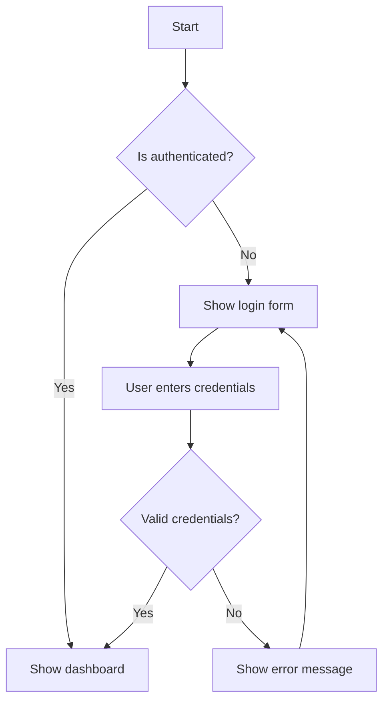

# Documentation Style Guide

## Overview

This style guide provides comprehensive guidelines for writing consistent, clear, and professional documentation. Following these standards ensures that all documentation maintains quality and usability across the project.

## Table of Contents

1. [Writing Style](#writing-style)
2. [Document Structure](#document-structure)
3. [Code Examples](#code-examples)
4. [Markdown Guidelines](#markdown-guidelines)
5. [API Documentation](#api-documentation)
6. [Visual Elements](#visual-elements)
7. [Accessibility](#accessibility)
8. [Formatting Standards](#formatting-standards)
9. [Common Mistakes](#common-mistakes)
10. [Review Checklist](#review-checklist)

---

## Writing Style

### Voice and Tone

- **Use active voice** instead of passive voice
  - ✅ "Click the button to submit the form"
  - ❌ "The form is submitted when the button is clicked"

- **Write in present tense** for instructions and current behavior
  - ✅ "The function returns a promise"
  - ❌ "The function will return a promise"

- **Be conversational but professional**
  - ✅ "Let's start by installing the dependencies"
  - ❌ "The user shall proceed to install the dependencies"

- **Use second person** for instructions
  - ✅ "You can configure the settings by..."
  - ❌ "One can configure the settings by..."

### Language Guidelines

- **Use clear, simple language**
  - Avoid jargon and technical terms without explanation
  - Define acronyms on first use
  - Use common words instead of complex alternatives

- **Be concise but complete**
  - Remove unnecessary words
  - Include all essential information
  - Use bullet points for lists

- **Write for your audience**
  - Beginners: More explanation and context
  - Experienced developers: Focus on specifics

### Grammar and Mechanics

- **Use proper grammar and spelling**
- **Use sentence case for headings**
  - ✅ "Getting started with the API"
  - ❌ "Getting Started With The API"

- **Use consistent terminology**
  - Create a glossary of terms
  - Use the same term throughout documentation

- **Avoid unnecessary capitalization**
  - ✅ "user interface", "web application"
  - ❌ "User Interface", "Web Application"

---

## Document Structure

### Standard Structure

```markdown
# Title

## Overview
Brief description of what this document covers.

## Prerequisites
What users need to know or have before following this guide.

## Table of Contents
1. [Section 1](#section-1)
2. [Section 2](#section-2)
3. [Section 3](#section-3)

## Main Content
Detailed content with examples and explanations.

## Troubleshooting
Common issues and solutions.

## Related Resources
Links to related documentation.

## Changelog
Version history and changes.
```

### Heading Hierarchy

- **Use proper heading levels** (H1 → H2 → H3 → H4)
- **Don't skip heading levels**
- **Use descriptive headings** that tell users what they'll find

```markdown
# Main Title (H1)

## Major Section (H2)

### Subsection (H3)

#### Details (H4)

##### Avoid going deeper than H4
```

### Page Length

- **Keep pages focused** on a single topic
- **Break long documents** into smaller sections
- **Use subpages** for complex topics
- **Aim for 1,000-2,000 words** per page

---

## Code Examples

### Best Practices

- **Include complete, runnable examples**
- **Explain what the code does**
- **Use realistic examples**
- **Show both input and output**
- **Include error handling**

### Code Block Format

```markdown
```javascript
// Good: Complete example with context
import { ApiClient } from './api-client';

const client = new ApiClient('your-api-key');

async function fetchUser(userId) {
  try {
    const user = await client.get(`/users/${userId}`);
    console.log('User:', user);
    return user;
  } catch (error) {
    console.error('Error fetching user:', error.message);
    throw error;
  }
}

// Usage
fetchUser('123').then(user => {
  console.log('Fetched user:', user.name);
});
```
```

### Inline Code

- **Use backticks** for inline code: `variable`, `function()`
- **Use for specific terms**: API endpoints, file names, code snippets
- **Don't overuse** - only for actual code references

### Code Comments

```javascript
// Good: Explain the purpose
function calculateTax(amount, rate) {
  // Apply tax rate and round to 2 decimal places
  return Math.round(amount * rate * 100) / 100;
}

// Bad: State the obvious
function calculateTax(amount, rate) {
  // Multiply amount by rate
  return amount * rate;
}
```

---

## Markdown Guidelines

### Formatting Standards

#### Emphasis
- **Bold** for important terms or UI elements
- *Italic* for emphasis or book titles
- `Code` for inline code or technical terms

#### Lists
- Use `-` for unordered lists
- Use `1.` for ordered lists
- Indent nested lists with 2 spaces

```markdown
- First item
- Second item
  - Nested item
  - Another nested item
- Third item

1. First step
2. Second step
   1. Sub-step
   2. Another sub-step
3. Third step
```

#### Links
- Use descriptive link text
- Include the protocol (https://)
- Use reference links for repeated URLs

```markdown
<!-- Good -->
Check out the [API documentation](https://api.example.com/docs) for more details.

<!-- Bad -->
Check out the API documentation [here](https://api.example.com/docs).

<!-- Reference links -->
[API documentation]: https://api.example.com/docs
[GitHub repository]: https://github.com/owner/repo
```

#### Images
- Use descriptive alt text
- Include captions when helpful
- Optimize file sizes

```markdown


*Figure 1: The main dashboard showing user statistics and recent activity*
```

### Tables

```markdown
| Column 1 | Column 2 | Column 3 |
|----------|----------|----------|
| Data 1   | Data 2   | Data 3   |
| Data 4   | Data 5   | Data 6   |
```

### Blockquotes

```markdown
> **Note**: This is important information that users should be aware of.

> **Warning**: This action cannot be undone.

> **Tip**: You can use keyboard shortcuts to speed up your workflow.
```

---

## API Documentation

### Endpoint Documentation

```markdown
#### `POST /api/users`

**Description**: Creates a new user account.

**Headers**:
- `Content-Type: application/json`
- `Authorization: Bearer {token}`

**Request Body**:
```json
{
  "name": "string",
  "email": "string",
  "password": "string"
}
```

**Response**:
```json
{
  "success": true,
  "data": {
    "id": "string",
    "name": "string",
    "email": "string",
    "createdAt": "string"
  }
}
```

**Example**:
```javascript
const response = await fetch('/api/users', {
  method: 'POST',
  headers: {
    'Content-Type': 'application/json',
    'Authorization': 'Bearer your-token'
  },
  body: JSON.stringify({
    name: 'John Doe',
    email: 'john@example.com',
    password: 'securepassword123'
  })
});

const user = await response.json();
console.log('Created user:', user);
```

**Error Responses**:
- `400 Bad Request`: Invalid input data
- `401 Unauthorized`: Invalid or missing token
- `409 Conflict`: Email already exists
```

### Function Documentation

```markdown
#### `formatDate(date, format)`

**Description**: Formats a date according to a specified format string.

**Parameters**:
- `date` (Date|string|number): The date to format
- `format` (string): Format string using these tokens:
  - `YYYY` - 4-digit year
  - `MM` - 2-digit month
  - `DD` - 2-digit day
  - `HH` - 2-digit hour (24-hour)
  - `mm` - 2-digit minute

**Returns**: `string` - The formatted date string

**Example**:
```javascript
const date = new Date('2024-07-15T10:30:00');

formatDate(date, 'YYYY-MM-DD');          // '2024-07-15'
formatDate(date, 'DD/MM/YYYY HH:mm');    // '15/07/2024 10:30'
formatDate(date, 'MMM DD, YYYY');        // 'Jul 15, 2024'
```

**Throws**:
- `TypeError`: When date parameter is invalid
- `Error`: When format string is invalid

**Since**: v1.0.0
```

---

## Visual Elements

### Callout Boxes

```markdown
> **💡 Tip**: Use keyboard shortcuts to improve your productivity.

> **⚠️ Warning**: This action will permanently delete all data.

> **ℹ️ Info**: Additional information that might be helpful.

> **❌ Error**: Common error and how to fix it.

> **✅ Success**: Confirmation of successful completion.
```

### Icons and Emojis

- **Use consistently** throughout documentation
- **Choose appropriate icons** for the content
- **Don't overuse** - they should enhance, not distract

### Diagrams and Flowcharts

```markdown

```

### Screenshots

- **Use high-quality images** (at least 1080p)
- **Crop appropriately** to focus on relevant content
- **Add annotations** to highlight important elements
- **Keep consistent styling** across all screenshots

---

## Accessibility

### Writing for Accessibility

- **Use descriptive link text**
  - ✅ "Download the installation guide"
  - ❌ "Click here to download"

- **Provide alt text** for all images
- **Use heading hierarchy** properly
- **Write clear instructions** that don't rely on visual cues alone

### Screen Reader Considerations

- **Use semantic HTML** in markdown
- **Provide context** for code examples
- **Use descriptive table headers**
- **Include transcripts** for video content

### Color and Contrast

- **Don't rely on color alone** to convey information
- **Use high contrast** for text
- **Test with color blindness** simulators

---

## Formatting Standards

### File Naming

- **Use kebab-case** for file names: `api-documentation.md`
- **Be descriptive** but concise
- **Include version numbers** when appropriate: `v2-migration-guide.md`

### Directory Structure

```
docs/
├── README.md
├── api/
│   ├── overview.md
│   ├── authentication.md
│   └── endpoints/
│       ├── users.md
│       └── orders.md
├── guides/
│   ├── getting-started.md
│   ├── installation.md
│   └── deployment.md
└── reference/
    ├── functions.md
    └── components.md
```

### Line Length

- **Wrap lines at 80 characters** for readability
- **Use soft wraps** in editors
- **Break long links** using reference style

### Whitespace

- **Use blank lines** to separate sections
- **Indent consistently** (2 spaces for lists)
- **Don't use trailing spaces**

---

## Common Mistakes

### Writing Issues

- **Assuming too much knowledge**
  - Always explain concepts that might be unfamiliar
  - Link to external resources for complex topics

- **Being too vague**
  - ❌ "Configure the settings appropriately"
  - ✅ "Set the timeout value to 30 seconds"

- **Using inconsistent terminology**
  - Create a glossary and stick to it
  - Use the same term throughout all documentation

### Code Issues

- **Incomplete examples**
  - Missing imports or dependencies
  - Showing only fragments without context

- **Outdated code**
  - Regular reviews to ensure examples work
  - Update with new API versions

- **No error handling**
  - Always show how to handle errors
  - Include common error scenarios

### Formatting Issues

- **Inconsistent formatting**
  - Use linting tools for markdown
  - Follow the style guide consistently

- **Poor heading structure**
  - Don't skip heading levels
  - Use descriptive headings

- **Bad link practices**
  - Dead links
  - Non-descriptive link text

---

## Review Checklist

### Content Review

- [ ] **Clear and concise writing**
- [ ] **Proper grammar and spelling**
- [ ] **Consistent terminology**
- [ ] **Complete information**
- [ ] **Appropriate level of detail**
- [ ] **Logical organization**

### Technical Review

- [ ] **Code examples work**
- [ ] **API documentation is accurate**
- [ ] **Links are functional**
- [ ] **Screenshots are current**
- [ ] **Dependencies are listed**
- [ ] **Error scenarios covered**

### Style Review

- [ ] **Follows markdown guidelines**
- [ ] **Consistent formatting**
- [ ] **Proper heading hierarchy**
- [ ] **Appropriate use of emphasis**
- [ ] **Alt text for images**
- [ ] **Descriptive link text**

### Accessibility Review

- [ ] **Screen reader friendly**
- [ ] **Color contrast appropriate**
- [ ] **Semantic structure**
- [ ] **Alternative text present**
- [ ] **Keyboard navigation possible**

---

## Tools and Resources

### Recommended Tools

- **Markdown editors**: Typora, Mark Text, VS Code
- **Grammar checking**: Grammarly, ProWritingAid
- **Spell checking**: Built-in tools, aspell
- **Link checking**: markdown-link-check
- **Style checking**: markdownlint

### Templates

#### Document Template

```markdown
# Document Title

## Overview
Brief description of what this document covers.

## Prerequisites
- List of requirements
- Links to prerequisite knowledge

## Instructions
Step-by-step instructions with examples.

## Examples
Complete working examples.

## Troubleshooting
Common issues and solutions.

## Related Resources
- [Link to related docs]
- [External resources]

---

*Last updated: [Date] | Version: [Version]*
```

#### API Template

```markdown
#### `method /endpoint`

**Description**: What this endpoint does.

**Parameters**:
- `param` (type): Description

**Returns**: Return type and description

**Example**:
```language
// Code example
```

**Since**: Version number
```

---

## Maintenance

### Regular Updates

- **Review quarterly** for accuracy
- **Update with new features**
- **Fix broken links**
- **Refresh screenshots**
- **Update dependencies**

### Version Control

- **Use semantic versioning** for documentation
- **Tag releases** with documentation versions
- **Maintain changelog** for documentation changes
- **Archive old versions** appropriately

### Feedback Integration

- **Collect user feedback** regularly
- **Monitor support channels** for common questions
- **Update based on user needs**
- **Test with real users**

---

## Conclusion

Following this style guide ensures that all documentation maintains high quality and consistency. Regular reviews and updates help keep the documentation current and useful for all users.

Remember: Good documentation is crucial for project success. Invest the time to do it right, and both users and contributors will benefit.

---

*This style guide is a living document that evolves with the project. For the latest version, please check the repository.*